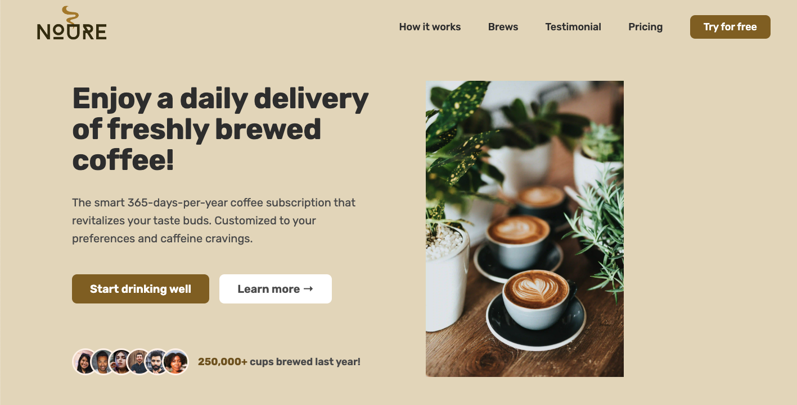

# Noure Coffee Landing Page



## Description

This repository contains the source code for a responsive landing page for Noure Coffee. The landing page is built using native HTML, CSS, and JavaScript to ensure high performance and cross-browser compatibility. The design is optimized for various screen sizes, providing an excellent user experience on both desktop and mobile devices.

You can view and use the landing page at [noure.netlify.app](https://noure.netlify.app).

## Features

- **Responsive Design:** Adjusts seamlessly to different screen sizes and devices.
- **Modern UI/UX:** Clean and intuitive user interface with a focus on user experience.
- **Performance Optimized:** Efficient code to ensure fast loading times.
- **Cross-Browser Compatibility:** Works consistently across all major browsers.
- **Interactive Elements:** Includes dynamic elements such as sliders and modals implemented in vanilla JavaScript.

## Technologies Used

- **HTML5:** For the structure and content of the webpage.
- **CSS3:** For styling, including Flexbox and Grid for layout, as well as media queries for responsiveness.
- **JavaScript:** For interactivity and dynamic content.

## Installation

1. Clone the repository:
   ```sh
   git clone https://github.com/yourusername/noure-coffee-landing-page.git

2. Navigate to the project directory:
   ```sh
   cd noure-coffee-landing-page

3. Open index.html in your preferred web browser to view the landing page:

## Usage
- Customize the content by editing the HTML files.
- Adjust styles in the CSS files located in the styles directory.
- Modify or add JavaScript functionality in the scripts directory.
- Contributing
- Contributions are welcome! Please feel free to submit a pull request or open an issue for any bugs or feature requests.

## License
- This project is licensed under the MIT License - see the LICENSE file for details.
  
